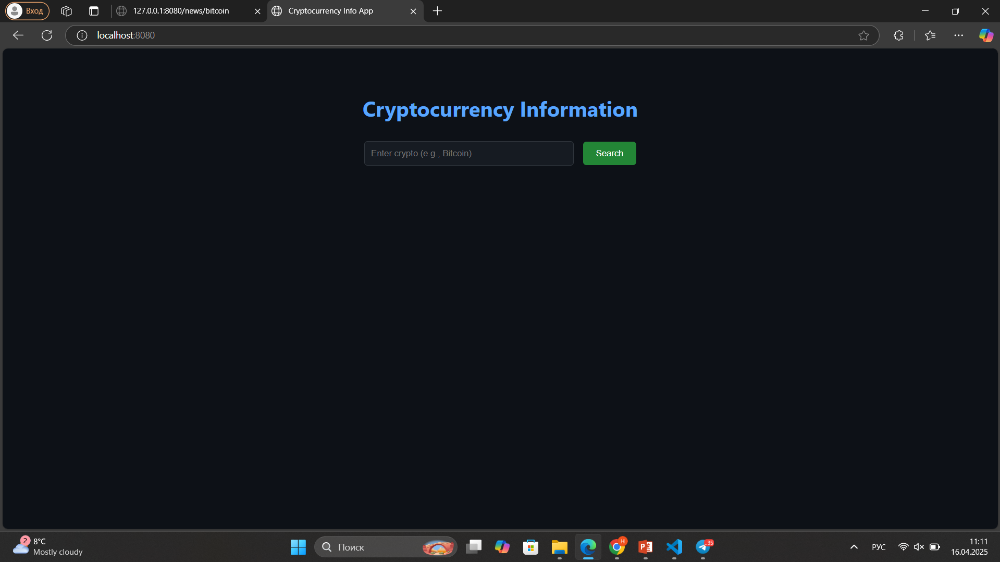
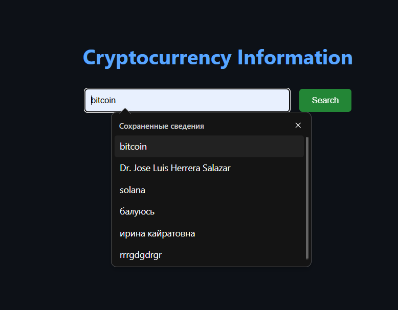
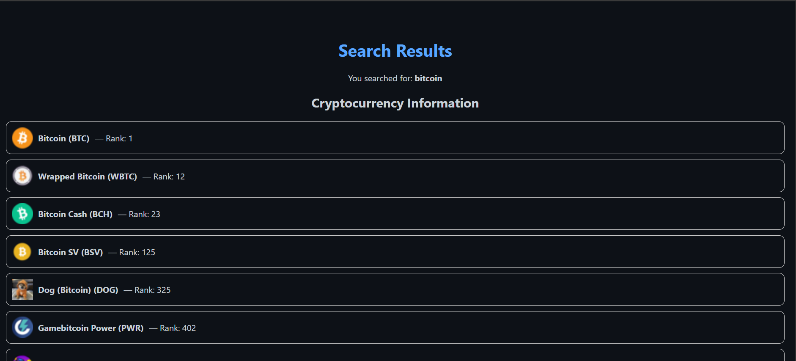

# Cryptocurrency News Aggregator
### Students Name and Group:
- Bassanova Nurgul (SE-2323)
- Tamyzgazina Ulzhan (SE-2325)

## Project Overview
Cryptocurrency News Aggregator is a Rust-based web service that aggregates and displays the latest cryptocurrency news from external APIs. It offers a clean, browser-accessible interface where users can search for crypto-related news by keyword and view a list of relevant articles.

## Key Features
- Real-time news aggregation from NewsAPI
- Lightweight and responsive web interface using Actix Web
- Search functionality for cryptocurrency-specific terms
- Easy configuration with environment variables

## Technologies Used
- Rust — Core language used for backend logic
- Actix-Web — Web framework for routing and serving HTML
- Reqwest — HTTP client used to call external news APIs
- NewsAPI — Main source for cryptocurrency news articles
- Serde — For parsing and serializing JSON responses
- dotenv — For environment-based configuration
- Tokio — Asynchronous runtime for Rust

##  Installation & Setup

### Prerequisites
- [Rust](https://www.rust-lang.org/tools/install)
- `cargo` (comes with Rust)
- A valid [NewsAPI](https://newsapi.org/) API key

### Steps

1. **Clone the repository**
   ```bash
   git clone https://github.com/your-username/crypto_news_aggregator.git
   cd crypto_news_aggregator
   ```

2. **Create a `.env` file**
   ```env
   NEWS_API_KEY=our_news_api_key_here
   PORT=8080
   ```

3. **Build and run the application**
   ```bash
   cargo run
   ```

4. **Open your browser**
   ```
   http://localhost:8080
   ```


##  Usage

- **Home Page**: Simple search bar for entering crypto keywords (e.g., `Bitcoin`, `Ethereum`).
- **Results Page**: Displays a list of news articles relevant to the keyword, including title, description, and source link.


## Folder Structure

```
.
├── src/
│   ├── main.rs              # Main app logic & Actix routes
│   ├── models.rs            # Structs for parsing API responses
│   └── news_service.rs      # News fetching logic
├── static/
│   └── style.css            # Static CSS files
├── .env                     # Environment variables
├── Cargo.toml               # Rust project configuration
└── README.md                # Project description and instructions
```

## Screenshoots





## MIT License
MIT License

Copyright (c) 2025

Permission is hereby granted, free of charge, to any person obtaining a copy
of this software and associated documentation files (the "Software"), to deal
in the Software without restriction, including without limitation the rights
to use, copy, modify, merge, publish, distribute, sublicense, and/or sell
copies of the Software, and to permit persons to whom the Software is
furnished to do so, subject to the following conditions:

The above copyright notice and this permission notice shall be included in all
copies or substantial portions of the Software.

THE SOFTWARE IS PROVIDED "AS IS", WITHOUT WARRANTY OF ANY KIND, EXPRESS OR
IMPLIED, INCLUDING BUT NOT LIMITED TO THE WARRANTIES OF MERCHANTABILITY,
FITNESS FOR A PARTICULAR PURPOSE AND NONINFRINGEMENT. IN NO EVENT SHALL THE
AUTHORS OR COPYRIGHT HOLDERS BE LIABLE FOR ANY CLAIM, DAMAGES OR OTHER
LIABILITY, WHETHER IN AN ACTION OF CONTRACT, TORT OR OTHERWISE, ARISING FROM,
OUT OF OR IN CONNECTION WITH THE SOFTWARE OR THE USE OR OTHER DEALINGS IN THE
SOFTWARE.
